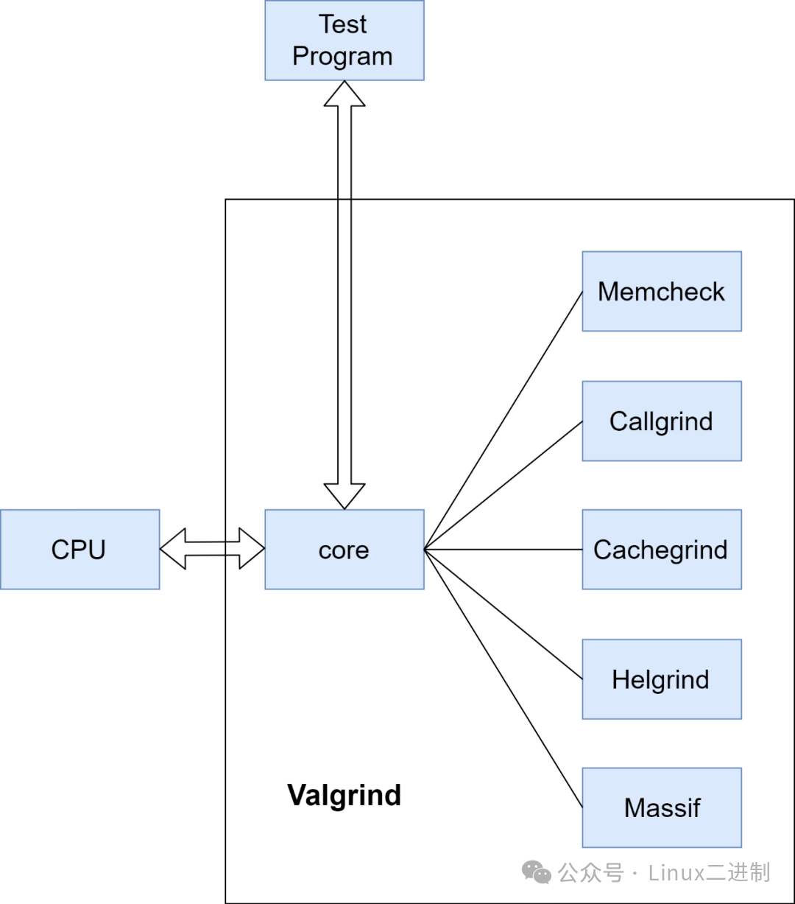
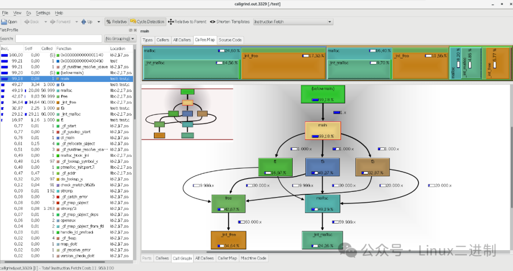

# Valgrind | 让代码问题无处遁形，函数调用一目了然
> 本文来自公众号文章：https://mp.weixin.qq.com/s/1jHD6oUH76d4waDWHqSdrQ  
> 原创作者：鲨齿不挑食

## valgrind 概述
Valgrind 是一套 Linux 下，开放源代码（GPL V2）的仿真调试工具的集合，包含多个工具，如Memcheck、Callgrind、Cachegrind、Helgrind、Massif，主要用于帮助开发者发现和解决程序中的内存泄露检测、数据竞争、死锁、缓存性能分析、生成函数调用图和其它问题。

### Memcheck 
Memcheck 是 Valgrind 工具集中的一款重要的工具，它主要用于检测 C 和 C++ 程序中的各种内存管理错误。Memcheck 通过插桩技术（Instrumentation）来实现其功能，这意味着它会在程序运行时动态地插入额外的指令，以监视程序的内存操作。具体来说，Memcheck 监视程序中的所有内存分配（例如通过 malloc 或 new）和释放（例如 free 或 delete），并记录这些操作的详细信息。当程序执行时，Memcheck 会对这些内存操作进行跟踪，查找任何可能违反内存使用规则的行为。

Memcheck 能够检测到的主要内存错误类型包括但不限于：
- 内存泄漏：程序未能正确释放不再使用的内存。
- 未初始化的内存使用：在没有被初始化的情况下使用内存区域。
- 越界读写：访问超出分配内存范围之外的地址。
- 重叠释放：释放已被释放的内存块。
- 无效指针使用：使用空指针或已经失效的指针。

### Callgrind
Callgrind 是 Valgrind 工具集中一款强大的工具，专门用于收集程序的函数调用图信息和性能统计数据。它不直接模拟缓存行为，而是侧重于分析函数调用的频率、成本以及每个函数的性能指标。通过模拟程序的执行过程，Callgrind 跟踪每一次函数调用，并记录相关的性能指标，如缓存未命中次数、内存访问次数以及每行代码、每个函数、每个模块乃至整个程序产生的指令数量。在运行结束时，它会把分析数据写入一个文件。

callgrind_annotate 可以把这个文件的内容转化成可读的形式。

### Cachegrind
achegrind 是 Valgrind 工具集中的一款工具，专门用于收集程序的缓存行为信息和性能统计数据。它能够模拟 CPU 的一级指令缓存 (I1)、一级数据缓存 (D1) 以及二级缓存 (L2)，从而精确追踪程序中的缓存命中与未命中情况。通过模拟程序的执行过程，Cachegrind 能够收集详细的缓存行为数据，帮助开发者了解程序的缓存使用效率，并据此进行优化。

### Helgrind
Helgrind 是 Valgrind 工具集中的一款专门用于检测多线程程序中的内存错误和竞态条件的工具。它能够帮助开发者识别程序中可能导致数据不一致的线程安全问题，如条件竞争、死锁、数据竞争等。Helgrind 通过监控程序的运行来检测这些问题，它可以检测到线程间的条件竞争、数据竞争等常见的多线程编程问题。它的工作原理是通过模拟程序的执行，监视每个线程的活动，并在检测到潜在问题时发出警告。Helgrind 的输出通常包括详细的错误报告，帮助开发者定位问题所在的代码位置。

### Massif
Massif 是 Valgrind 内存调试工具套件中的一个高性能堆内存分析器，专门用于检测程序运行时的内存使用情况。它不仅能监控堆内存的分配与释放，还能够监测栈内存、映射文件（mmap）内存以及已分配但未使用的内存区域。Massif 通过记录内存使用快照来帮助开发者识别内存泄漏、过度分配等问题，并提供详细的报告来展示内存使用趋势及峰值。开发者可以利用这些信息优化程序的内存使用效率，减少内存消耗，提高性能。值得注意的是，尽管 Massif 主要针对堆内存进行分析，但它通过扩展配置也能有效地监控栈内存和其他类型的内存使用情况，从而提供更为全面的内存诊断功能。

---
Valgrind 由内核（core，即一个软件合成的 CPU）以及基于内核的其他调试工具组成。内核类似于一个框架（framework），它模拟了一个 CPU 环境，并提供服务给其他工具；而其他工具则类似于插件 (plug-in)，利用内核提供的服务完成各种特定的内存调试任务。Valgrind 基于仿真的方式对程序进行调试，它先于应用程序获取实际处理器的控制权，并在实际处理器的基础上仿真一个虚拟处理器，并使应用程序运行于这个虚拟处理器之上，从而对应用程序的运行进行监视。下面的架构图展示了这一过程的关键组件及其相互关系：



应用程序并不知道该处理器是虚拟的还是实际的，已经编译成二进制代码的应用程序并不用重新进行编译，Valgrind 直接解释二进制代码使得应用程序基于它运行，从而能够检查内存操作时可能出现的错误。

所以在 Valgrind 下运行的程序运行速度要慢得多，而且使用的内存要多得多。因此，最好在性能好的机器上使用 Valgrind，并且是在开发调试阶段使用。

## Valgrind安装和使用
### 1. 安装方式
1. 包管理器安装
大多数 Linux 发行版都提供了 Valgrind 的预编译二进制包，你可以使用系统的包管理器轻松安装。例如：
    - Debian/Ubuntu:  
        ```shell
        sudo apt-get update
        sudo apt-get install valgrind
        ```  
    - CentOS/RHEL:  
        ```shell
        sudo yum install valgrind
        ```  
    - Fedora:  
        ```shell
        sudo dnf install valgrind
        ```  
    - macOS (使用 Homebrew):  
        ```shell
        brew install valgrind
        ```  
2. 源代码编译安装
如果你需要定制 Valgrind 或者你的系统没有预编译的包，可以考虑从源码编译安装。
    - 下载源码

        ```shell
        # 方式一，直接下载压缩包
        wget https://sourceware.org/pub/valgrind/valgrind-3.23.0.tar.bz2
        tar -xvf valgrind-3.23.0.tar.bz2
        cd valgrind-3.23.0/

        # 方式二，使用git clone
        git clone git://sourceware.org/git/valgrind.git 
        cd valgrind/
        ```

    - 配置编译选项
        ```shell
        ./autogen.sh
        ./configure
        ```

    - 编译和安装
        ```shell
        make
        sudo make installshell
        ```

### 2.命令格式
Valgrind 是非侵入式的，你只需要调用 Valgrind 运行你的程序即可，而不需要重新链接、重新编译或以其他方式修改要检查的程序。命令格式如下：

```
valgrind [valgrind-options] your-prog [your-prog-options]
```

Valgrind 的参数主要分为两大类：一类是核心参数，适用于所有 Valgrind 工具；另一类则是针对特定工具（如 Memcheck）的参数。为了满足不同的调试需求，Valgrind 提供了丰富的配置选项。详情可参阅 Valgrind 的官方用户手册。

其中，最重要的选项之一是 --tool，它用于指定运行哪个 Valgrind 工具，无论那种工具，Valgrind 都是非侵入性的。要想使用 Memcheck，可以在 Valgrind 命令行上指定 --tool=memcheck。不过，不必这样做，因为 Memcheck 是 Valgrind 的默认工具。Valgrind 通过读取调试信息获取链接库、执行库，来输出程序运行时状态，并且定位异常代码位置。这体现在，待调试程序会在 Valgrind 的控制下运行，Valgrind 内核会将待调试程序的代码交给所选工具（比如 memcheck），相应工具会添加一些自己的代码然后运行，将运行结果返回给 Valgrind 内核。

Valgrind 能模拟待调试程序执行的每条指令，所以，所选工具不仅检查或概要分析应用程序中的代码，而且还检查所有支持的动态链接库（包括 C 库，GUI 库等）中的代码。

### 3.工具选项
#### (1) Memcheck 选项  
memcheck 是 Valgrind 中的一个工具，用于检测程序中的内存错误，比如内存泄漏、越界读写等。下面是 memcheck 的一些常见选项及其用途：  
##### 基础选项：
- --tool=memcheck: 指定使用 memcheck 工具。 
- --leak-check=<level>: 控制内存泄漏检测的严格程度。可以设置为 no, summary, full, yes, fast 或 quick。  
    - no: 不检查内存泄漏。summary: 在程序退出时显示内存泄漏的总结。  
    - full: 显示所有未释放的块的完整堆栈跟踪信息。  
    - yes: 同 full。fast: 快速模式，不检测间接泄漏。  
    - quick: 类似于 fast，但只在程序退出时报告泄漏。  
- --show-leak-kinds=<kind>: 指定要报告的泄漏种类。可以是 definite (确定的泄漏), indirect (间接泄漏), possible (可能的泄漏) 和 still-reachable (可达的未释放块)。  
- --track-origins=yes: 跟踪错误起源的位置。这有助于找出错误发生的源代码位置。
- --track-fds=yes: 跟踪文件描述符的创建和销毁。
- --track-children=yes: 跟踪子进程的内存使用情况。
- --vgdb=no: 不启用 vgdb 模式。如果设置为 yes，则可以在调试时使用 gdb 连接到 Valgrind。 
##### 报告选项：
- --show-reachable=<level>: 控制显示哪些可达但未释放的内存块。
    - no: 不显示任何可达的块。
    - yes: 显示所有可达的块。
    - <n>: 显示大于或等于 n 字节的可达块。
- --show-possibly-lost=no: 是否显示可能丢失的内存块。
- --show-probably-lost=no: 是否显示很可能丢失的内存块。
- --show-reachable=yes: 是否显示可达的未释放内存块。
- --show-reachable-all=no: 是否显示所有可达的未释放内存块。
- --show-reachable-threshold=<bytes>: 设置最小阈值来过滤可达的未释放内存块。
- --show-reachable-exit=no: 是否在程序退出时显示可达的未释放内存块。
- --error-limit-count=<n>: 设置错误报告的最大数量。
- --error-exitcode=<n>: 如果发现错误，则使用指定的退出码退出。
- --log-file=<file>: 将报告输出到指定文件。
- --log-file-prefix=<prefix>: 将报告输出到以指定前缀命名的文件。
- --log-file-uid-only=yes: 使用用户 ID 作为文件名的一部分。
- --log-file-stderr=yes: 将报告同时输出到标准错误流。
##### 内存分配选项：
- --malloc-fill=<value>: 分配内存时填充的值。
- --free-fill=<value>: 释放内存后填充的值。
- --alloc-failure-first=<n>: 在分配第 n 次内存时失败。
- --alloc-failure-mode=<mode>: 设置分配失败模式，可以是 abort, fail, warn 或 ignore。
- --alloc-failure-skip-n-allocation-types=<n>: 跳过前 n 种分配类型。
- --alloc-failure-skip-n-allocation-sizes=<n>: 跳过前 n 个分配大小。
- --alloc-failure-skip-n-allocation-numbers=<n>: 跳过前 n 个分配编号。
- --alloc-failure-skip-n-allocation-numbers-last=<n>: 跳过最后 n 个分配编号。
- --alloc-failure-skip-n-allocation-types-last=<n>: 跳过最后 n 种分配类型。
- --alloc-failure-skip-n-allocation-sizes-last=<n>: 跳过最后 n 个分配大小。  
##### 其他选项：
- --suppressions=<file>: 指定一个抑制文件，其中包含错误和警告的例外列表。
- --vgdb=no: 是否启动 Valgrind GDB 模式。
- --vgdb-error=no: 发现错误时是否自动启动 Valgrind GDB 模式。
- --vgdb-again=no: 在 Valgrind GDB 模式下是否再次运行程序。
- --vgdb-kill=no: 在 Valgrind GDB 模式下是否终止程序。
- --vgdb-error-file=<file>: 将错误信息写入指定文件。
##### 示例命令
下面是一个使用 memcheck 的示例命令，它将检测程序中的内存泄漏，并在程序退出时显示泄漏的总结：  
```
valgrind --tool=memcheck --leak-check=full --show-leak-kinds=all ./myprogram
```
这将运行 myprogram 并提供详细的内存泄漏报告。

请注意，这些选项可能会随着 Valgrind 的版本更新而有所改变。建议查阅最新版本的手册页以获取最准确的信息。

#### (2) Callgrind 选项
callgrind 是 Valgrind 中的一个工具，主要用于生成程序的调用图（call graph），以便于分析程序中的函数调用模式和性能瓶颈。以下是 callgrind 的一些重要选项： 

##### 基本选项
- --tool=callgrind: 指定使用 callgrind 工具。

##### 通用选项
- --help: 显示帮助信息。
- --version: 显示版本信息。
- --quiet 或 -q: 仅打印错误消息，减少输出。
- --verbose 或 -v: 打印更多的调试信息。

##### 特定于 callgrind 的选项
- --callgrind-out-file=<filename>: 指定输出文件名，默认为 callgrind.out。该文件包含了调用图数据，可以使用 kcachegrind 或其他可视化工具进行查看。
- --instr-for-call: 指定用于跟踪函数调用的指令类型。默认情况下，callgrind 会在每个函数调用之前和之后插入指令。
- --collect-jumps: 收集间接跳转信息。这可以帮助识别性能瓶颈，尤其是在循环中。
- --collect-jump-targets: 收集间接跳转的目标地址。与 --collect-jumps 一起使用，可以获得更详细的跳转信息。
- --simulate-cache: 模拟缓存行为。这可以用来分析缓存命中率和缺失情况。
- --cache-sim=<L1i,L1d,L2>: 指定要模拟的缓存层级。例如，--cache-sim=32K,64,64,256K,64,16 表示 L1i 缓存大小为 32KB、缓存行大小为 64 字节、关联度为 64，L2 缓存大小为 256KB、缓存行大- 小为 64 字节、关联度为 16。
- --simulate-translator-cache: 模拟翻译缓存行为。这对于分析翻译缓存的效率很有用。
- --simulate-translator-cache-size=<number>: 指定翻译缓存的大小。
- --simulate-translator-cache-line-size=<number>: 指定翻译缓存行的大小。
- --simulate-translator-cache-associativity=<number>: 指定翻译缓存的关联度。
- --simulate-translator-cache-victim-cache-size=<number>: 指定翻译缓存受害者缓存的大小。
- --simulate-translator-cache-victim-cache-line-size=<number>: 指定翻译缓存受害者缓存行的大小。
- --simulate-translator-cache-victim-cache-associativity=<number>: 指定翻译缓存受害者缓存的关联度。
- --simulate-translator-cache-branch-predictor=<number>: 指定分支预测器的大小。
- --simulate-translator-cache-branch-predictor-history-length=<number>: 指定分支预测器的历史长度。
- --simulate-translator-cache-branch-predictor-type=<type>: 指定分支预测器的类型。
- --simulate-translator-cache-branch-predictor-misprediction-cost=<number>: 指定分支预测失败的成本。

##### 其他选项
- --instr-atstart: 指定在每个函数开始时插入指令。
- --instr-atend: 指定在每个函数结束时插入指令。
- --instr-atcall: 指定在每个函数调用时插入指令。
- --instr-atreturn: 指定在每个函数返回时插入指令。
- --instr-atthrow: 指定在抛出异常时插入指令。
- --instr-atcatch: 指定在捕获异常时插入指令。
- --instr-atcall-precise: 指定在每个函数调用前精确插入指令。
- --instr-atreturn-precise: 指定在每个函数返回前精确插入指令。
- --instr-atthrow-precise: 指定在抛出异常前精确插入指令。
- --instr-atcatch-precise: 指定在捕获异常前精确插入指令。
- --instr-atcall-unwind: 指定在每个函数调用时进行栈展开。
- --instr-atreturn-unwind: 指定在每个函数返回时进行栈展开。
- --instr-atthrow-unwind: 指定在抛出异常时进行栈展开。
- --instr-atcatch-unwind: 指定在捕获异常时进行栈展开。
- --instr-atcall-unwind-precise: 指定在每个函数调用时精确地进行栈展开。
- --instr-atreturn-unwind-precise: 指定在每个函数返回时精确地进行栈展开。
- --instr-atthrow-unwind-precise: 指定在抛出异常时精确地进行栈展开。
- --instr-atcatch-unwind-precise: 指定在捕获异常时精确地进行栈展开。
- --instr-atcall-stack-unwind: 指定在每个函数调用时进行完整的栈展开。
- --instr-atreturn-stack-unwind: 指定在每个函数返回时进行完整的栈展开。
- --instr-atthrow-stack-unwind: 指定在抛出异常时进行完整的栈展开。
- --instr-atcatch-stack-unwind: 指定在捕获异常时进行完整的栈展开。
- --instr-atcall-stack-unwind-precise: 指定在每个函数调用时精确地进行完整的栈展开。
- --instr-atreturn-stack-unwind-precise: 指定在每个函数返回时精确地进行完整的栈展开。
- --instr-atthrow-stack-unwind-precise: 指定在抛出异常时精确地进行完整的栈展开。
- --instr-atcatch-stack-unwind-precise: 指定在捕获异常时精确地进行完整的栈展开。
##### 示例命令
下面是一个使用 callgrind 的示例命令，它将收集调用图数据，并将输出保存到指定的文件中：  

```
valgrind --tool=callgrind --callgrind-out-file=myprogram.callgrind myprogram
```  

这会运行 myprogram 并将调用图数据保存到 myprogram.callgrind 文件中。之后，你可以使用 kcachegrind 或其他可视化工具打开此文件，以分析程序的性能。

请注意，callgrind 的选项可能因 Valgrind 版本的不同而有所变化。建议查阅最新版本的手册以获取最准确的信息。

#### (3) Cachegrind 选项
cachegrind 是 Valgrind 中的一个工具，用于模拟 CPU 的缓存行为，帮助开发者了解程序在不同层级缓存中的命中率和缺失率，从而优化程序性能。下面是 cachegrind 的一些常见选项及其用途：

##### 基础选项
- --tool=cachegrind: 指定使用 cachegrind 工具。

##### 缓存模拟选项
- --cache-sim=<L1i,L1d,L2>: 指定要模拟的缓存层级。例如，--cache-sim=32K,64,64,256K,64,16 表示 L1i 缓存大小为 32KB、缓存行大小为 64 字节、关联度为 64，L2 缓存大小为 256KB、缓存行大- 小为 64 字节、关联度为 16。
- --simulate-cache: 指定是否模拟缓存行为。
- --simulate-translator-cache: 指定是否模拟翻译缓存行为。
- --simulate-translator-cache-size=<number>: 指定翻译缓存的大小。
- --simulate-translator-cache-line-size=<number>: 指定翻译缓存行的大小。
- --simulate-translator-cache-associativity=<number>: 指定翻译缓存的关联度。
- --simulate-translator-cache-victim-cache-size=<number>: 指定翻译缓存受害者缓存的大小。
- --simulate-translator-cache-victim-cache-line-size=<number>: 指定翻译缓存受害者缓存行的大小。
- --simulate-translator-cache-victim-cache-associativity=<number>: 指定翻译缓存受害者缓存的关联度。
- --simulate-translator-cache-branch-predictor=<number>: 指定分支预测器的大小。
- --simulate-translator-cache-branch-predictor-history-length=<number>: 指定分支预测器的历史长度。
- --simulate-translator-cache-branch-predictor-type=<type>: 指定分支预测器的类型。
- --simulate-translator-cache-branch-predictor-misprediction-cost=<number>: 指定分支预测失败的成本。

##### 输出选项
- --callgrind-out-file=<filename>: 指定输出文件名，默认为 callgrind.out。该文件包含了缓存模拟数据，可以使用 kcachegrind 或其他可视化工具进行查看。

##### 其他选项
- --collect-jumps: 收集间接跳转信息。这可以帮助识别性能瓶颈，尤其是在循环中。
- --collect-jump-targets: 收集间接跳转的目标地址。与 --collect-jumps 一起使用，可以获得更详细的跳转信息。
- --vgdb=no: 是否启动 Valgrind GDB 模式。
- --vgdb-error=no: 发现错误时是否自动启动 Valgrind GDB 模式。
- --vgdb-again=no: 在 Valgrind GDB 模式下是否再次运行程序。
- --vgdb-kill=no: 在 Valgrind GDB 模式下是否终止程序。

##### 示例命令
下面是一个使用 cachegrind 的示例命令，它将模拟缓存行为，并将输出保存到指定的文件中：  
```
valgrind --tool=cachegrind --cache-sim=32K,64,64,256K,64,16 --callgrind-out-file=myprogram.cachegrind ./myprogram
```  

这会运行 myprogram 并将缓存模拟数据保存到 myprogram.cachegrind 文件中。之后，你可以使用 kcachegrind 或其他可视化工具打开此文件，以分析程序的缓存性能。

请注意，cachegrind 的选项可能因 Valgrind 版本的不同而有所变化。建议查阅最新版本的手册页以获取最准确的信息。

#### (4) Helgrind 选项
helgrind 是 Valgrind 中的一个工具，用于检测多线程程序中的数据竞争、锁使用不当等问题。下面是 helgrind 的一些常见选项及其用途：

##### 基础选项
- --tool=helgrind: 指定使用 helgrind 工具。

##### 锁检测选项
- --lock-precision=full: 设置锁检测的精度。默认情况下，helgrind 使用 full 精度，这意味着它会尝试检测所有类型的锁问题。
- --lock-precision=high: 设置高精度的锁检测。这比 full 稍慢，但可以检测到更广泛的锁问题。
- --lock-precision=medium: 设置中等精度的锁检测。这比 full 快，但可能会错过一些锁问题。
- --lock-precision=low: 设置低精度的锁检测。这比 medium 更快，但可能会错过更多的锁问题。
- --lock-precision=minimal: 设置最低精度的锁检测。这比 low 更快，但可能会错过更多的锁问题。
- --lock-precision=none: 不进行锁检测。

##### 错误报告选项
- --error-limit-count=<n>: 设置错误报告的最大数量。
- --error-exitcode=<n>: 如果发现错误，则使用指定的退出码退出。
- --log-file=<file>: 将报告输出到指定文件。
- --log-file-prefix=<prefix>: 将报告输出到以指定前缀命名的文件。
- --log-file-uid-only=yes: 使用用户 ID 作为文件名的一部分。
- --log-file-stderr=yes: 将报告同时输出到标准错误流。

##### 其他选项
- --vgdb=no: 是否启动 Valgrind GDB 模式。
- --vgdb-error=no: 发现错误时是否自动启动 Valgrind GDB 模式。
- --vgdb-again=no: 在 Valgrind GDB 模式下是否再次运行程序。
- --vgdb-kill=no: 在 Valgrind GDB 模式下是否终止程序。
- --vgdb-error-file=<file>: 将错误信息写入指定文件。
- --suppressions=<file>: 指定一个抑制文件，其中包含错误和警告的例外列表。
- --show-error-list=no: 是否显示检测到的错误列表。
- --show-error-list=all: 显示所有检测到的错误列表，包括被抑制的错误。

##### 示例命令
下面是一个使用 helgrind 的示例命令，它将检测程序中的数据竞争和锁问题，并在程序退出时显示所有检测到的错误列表：
```
valgrind --tool=helgrind --show-error-list=all ./myprogram
```

这将运行 myprogram 并提供详细的多线程错误报告。

请注意，这些选项可能会随着 Valgrind 的版本更新而有所改变。建议查阅最新版本的手册页以获取最准确的信息。

#### (5) Massif 选项
massif 是 Valgrind 中的一个工具，用于分析程序的堆内存使用情况，包括最大堆内存使用量、堆内存使用模式等。下面是 massif 的一些常见选项及其用途：

##### 基础选项
- --tool=massif: 指定使用 massif 工具。

##### 内存分析选项
- --ms_print-all: 输出所有内存快照的详细信息。
- --ms_print-peak: 输出达到峰值时的内存快照。
- --ms_print-peak-and-final: 输出达到峰值时及程序结束时的内存快照。
- --ms_print-peak-and-final-detailed: 输出达到峰值时及程序结束时的详细内存快照。
- --ms_print-peak-and-final-detailed-annotated: 输出达到峰值时及程序结束时的详细内存快照，并标注文件名和行号。
- --ms_print-peak-and-final-annotated: 输出达到峰值时及程序结束时的内存快照，并标注文件名和行号。
- --ms_print-peak-annotated: 输出达到峰值时的内存快照，并标注文件名和行号。
- --ms_print-final: 输出程序结束时的内存快照。
- --ms_print-final-annotated: 输出程序结束时的内存快照，并标注文件名和行号。
- --ms_print-final-detailed: 输出程序结束时的详细内存快照。
- --ms_print-final-detailed-annotated: 输出程序结束时的详细内存快照，并标注文件名和行号。
- --ms_print-peak-detailed: 输出达到峰值时的详细内存快照。
- --ms_print-peak-detailed-annotated: 输出达到峰值时的详细内存快照，并标注文件名和行号。

##### 输出选项
- --ms_output-file=<filename>: 指定输出文件名。默认情况下，文件名会根据程序名和 PID 自动生成。
- --ms_print-allocs: 输出所有分配操作的详细信息。
- --ms_print-allocs-detailed: 输出所有分配操作的详细信息，包括分配的内存块大小和位置。
- --ms_print-allocs-detailed-annotated: 输出所有分配操作的详细信息，包括分配的内存块大小、位置，并标注文件名和行号。
- --ms_print-allocs-annotated: 输出所有分配操作的详细信息，并标注文件名和行号。

##### 其他选项
- --vgdb=no: 是否启动 Valgrind GDB 模式。
- --vgdb-error=no: 发现错误时是否自动启动 Valgrind GDB 模式。
- --vgdb-again=no: 在 Valgrind GDB 模式下是否再次运行程序。
- --vgdb-kill=no: 在 Valgrind GDB 模式下是否终止程序。
- --vgdb-error-file=<file>: 将错误信息写入指定文件。
- --suppressions=<file>: 指定一个抑制文件，其中包含错误和警告的例外列表。
- --heap=<yes|no>: [默认值: yes] 指定是否进行堆分析。
- --stacks=<yes|no>: [默认值: no] 指定是否进行堆栈分析。此选项会大大降低Massif 的速度，默认情况下关闭。
- --pages-as-heap=<yes|no>:[默认值: no] 告诉 Massif 以页面级别而不是malloc'd块级别对内存进行分析。
- --depth=: [默认值: 30] 快照记录的分配树（调用栈）的最大深度。增加它将使Massif 运行稍微慢一些，使用更多内存，并生成更大的输出文件。
- --time-unit=<i|ms|B>: [默认值: i] 用于分析的时间单位。有三种可能性：指令执行次数（i），适用于大多数情况；真实（挂钟）时间（ms，即毫秒），有时会有用；堆和/或栈上分配/释放的字节数- （B），对于非常短暂的程序和测试目的很有用。--detailed-freq=: [默认值: 10] 详细快照的频率。--max-snapshots= : [默认值:100] 记录的最大快照数。如果设置为 N，除了非常短暂运行的程序外，- 最终的快照数量将在 N/2 和 N 之间。
- --massif-out-file=: [默认值: massif.out.%p] 将配置文件写入指定的文件中，而不是默认的输出文件 massif.out.%p%q。

##### 示例命令
下面是一个使用 massif 的示例命令，它将分析程序的堆内存使用情况，并将输出保存到指定的文件中：
```
valgrind --tool=massif --ms_print-peak-and-final-annotated --ms_output-file=myprogram.massif ./myprogram
```

这会运行 myprogram 并将堆内存分析数据保存到 myprogram.massif 文件中。之后，你可以使用 ms_print 或 ms_view 工具打开此文件，以分析程序的内存使用情况。

请注意，这些选项可能会随着 Valgrind 的版本更新而有所改变。建议查阅最新版本的手册页以获取最准确的信息。

### 4.注意事项
- 重新编译你的程序，使其附带调试信息（开启 -g 选项）。如果没有调试信息，Valgrind 无法定位异常代码位置。
- 如果待调试的是 C++ 程序，考虑去掉函数内联调用（开启 -fno-inline），这样可以更简单的查看函数调用堆栈。或者，使用 Valgrind 选项--read-inline-info = yes 可以读取内联函数的调试信息，这- 样，即便程序使用了内联函数也能正确的显示调用堆栈信息。
- 关闭编译优化（-O）。在 O1 以上的优化级别下，Memcheck工具会误报一些未初始化值的错误。
- 使用 -Wall 编译代码，他能识别 Valgrind 在较高优化级别上可能会遗漏的部分。

## Valgrind实战演示
### 1.Memcheck实战
#### (1)内存泄露
下面我将给出一个示例 C 程序以及如何使用 Valgrind 来检测内存泄露。首先，让我们创建一个简单的 C 程序，该程序将分配一些内存，但不会释放它，以模拟内存泄露的情况。

文件：memory_leak.c
```c
#include <stdlib.h>
#include <stdio.h>

int main() {
    int *data = malloc(100 * sizeof(int)); // 分配内存
    if (data != NULL) {
        for (int i = 0; i < 100; ++i) {
            data[i] = i; // 初始化内存
        }
        // 注意：这里没有释放 memory
    }
    return 0;
}
```

接下来，我们需要编译这个程序。确保你的编译器选项中包含 -g 标志，以便生成调试信息，这对于 Valgrind 来说是非常重要的。  
```shell
gcc -g -o memory_leak memory_leak.c
```

现在，我们将使用 Valgrind 的 Memcheck 工具来检测上面编译的程序是否存在内存泄露。
```shell
valgrind --tool=memcheck  ./memory_leak
```
Valgrind 的 Memcheck 将会报告任何潜在的内存泄露问题。以下是上面示例的输出：
```
[root@localhost memcheck_example]# valgrind --tool=memcheck  ./memory_leak
==145738== Memcheck, a memory error detector
==145738== Copyright (C) 2002-2024, and GNU GPL'd, by Julian Seward et al.
==145738== Using Valgrind-3.24.0.GIT and LibVEX; rerun with -h for copyright info
==145738== Command: ./memory_leak
==145738==
==145738==
==145738== HEAP SUMMARY:
==145738==     in use at exit: 400 bytes in 1 blocks
==145738==   total heap usage: 1 allocs, 0 frees, 400 bytes allocated
==145738==
==145738== LEAK SUMMARY:
==145738==    definitely lost: 400 bytes in 1 blocks
==145738==    indirectly lost: 0 bytes in 0 blocks
==145738==      possibly lost: 0 bytes in 0 blocks
==145738==    still reachable: 0 bytes in 0 blocks
==145738==         suppressed: 0 bytes in 0 blocks
==145738== Rerun with --leak-check=full to see details of leaked memory
==145738==
==145738== For lists of detected and suppressed errors, rerun with: -s
==145738== ERROR SUMMARY: 0 errors from 0 contexts (suppressed: 0 from 0)
```

在这个输出中，我们可以看到：  
- definitely lost: 确定丢失的内存字节数量和块数。
- indirectly lost: 间接丢失的内存字节数量和块数。
- possibly lost: 可能丢失的内存字节数量和块数。
- still reachable: 仍然可达但未释放的内存字节数量和块数。
- suppressed: 被抑制的内存字节数量和块数。

为了查看更详细的泄露信息，我们需要重新运行 Valgrind，并使用 --leak-check=full 选项。这次的输出将会更加详细，显示出确切的内存泄露位置。
```
[root@localhost memcheck_example]# valgrind --tool=memcheck --leak-check=full ./memory_leak
==145739== Memcheck, a memory error detector
==145739== Copyright (C) 2002-2024, and GNU GPL'd, by Julian Seward et al.
==145739== Using Valgrind-3.24.0.GIT and LibVEX; rerun with -h for copyright info
==145739== Command: ./memory_leak
==145739==
==145739==
==145739== HEAP SUMMARY:
==145739==     in use at exit: 400 bytes in 1 blocks
==145739==   total heap usage: 1 allocs, 0 frees, 400 bytes allocated
==145739==
==145739== 400 bytes in 1 blocks are definitely lost in loss record 1 of 1
==145739==    at 0x4C382A1: malloc (vg_replace_malloc.c:446)
==145739==    by 0x4005A7: main (memory_leak.c:5)
==145739==
==145739== LEAK SUMMARY:
==145739==    definitely lost: 400 bytes in 1 blocks
==145739==    indirectly lost: 0 bytes in 0 blocks
==145739==      possibly lost: 0 bytes in 0 blocks
==145739==    still reachable: 0 bytes in 0 blocks
==145739==         suppressed: 0 bytes in 0 blocks
==145739==
==145739== For lists of detected and suppressed errors, rerun with: -s
==145739== ERROR SUMMARY: 1 errors from 1 contexts (suppressed: 0 from 0)
```

从这个输出中，我们可以清楚地看到内存是在 main 函数的第 5 行通过 malloc 分配的，但没有释放。

以上就是一个简单的内存泄露检测案例。通过 Valgrind 的 Memcheck 工具，我们可以有效地检测和定位内存泄露问题，这对于开发高质量的软件至关重要。

#### (2) 使用未初始化的内存

下面是一个 C 语言程序，它定义了一个函数 use_uninitialized_memory，该函数使用未初始化的内存，并在主函数中调用它。

文件：uninit_memory.c
```c
#include <stdio.h>
#include <stdlib.h>

void use_uninitialized_memory() {
    int *ptr = (int *)malloc(sizeof(int)); // 分配内存但不初始化
    printf("Value of uninitialized memory: %d\n", *ptr); // 使用未初始化的内存
    free(ptr); // 释放内存
}

int main() {
    use_uninitialized_memory();
    return 0;
}
```

确保包含 -g 选项以生成调试信息，这对于 Valgrind 来说是必要的。
```shell
gcc -g -o uninit_memory uninit_memory.c
```

接下来，我们将使用 Valgrind 的 Memcheck 工具来检测程序中的未初始化内存使用情况。
```shell
valgrind --tool=memcheck --leak-check=full --track-origins=yes ./uninit_memory
```

使用 Valgrind 的 Memcheck 工具加上 --leak-check=full 和 --track-origins=yes 参数来运行程序时，我们能够得到更详细的内存泄漏和未初始化内存的来源信息。这些参数可以帮助我们找到程序中未初始化内存的具体位置以及潜在的内存泄漏问题。以下是上面示例的输出结果：
```
[root@localhost uninitial]# valgrind --tool=memcheck --leak-check=full --track-origins=yes ./uninit_memory
==145845== Memcheck, a memory error detector
==145845== Copyright (C) 2002-2024, and GNU GPL'd, by Julian Seward et al.
==145845== Using Valgrind-3.24.0.GIT and LibVEX; rerun with -h for copyright info
==145845== Command: ./uninit_memory
==145845==
==145845== Conditional jump or move depends on uninitialised value(s)
==145845==    at 0x4EB394B: vfprintf (in /usr/lib64/libc-2.28.so)
==145845==    by 0x4EBAF09: printf (in /usr/lib64/libc-2.28.so)
==145845==    by 0x400652: use_uninitialized_memory (uninit_memory.c:6)
==145845==    by 0x40066F: main (uninit_memory.c:11)
==145845==  Uninitialised value was created by a heap allocation
==145845==    at 0x4C382A1: malloc (vg_replace_malloc.c:446)
==145845==    by 0x400637: use_uninitialized_memory (uninit_memory.c:5)
==145845==    by 0x40066F: main (uninit_memory.c:11)
==145845==
==145845== Use of uninitialised value of size 8
==145845==    at 0x4EAFC7E: _itoa_word (in /usr/lib64/libc-2.28.so)
==145845==    by 0x4EB3337: vfprintf (in /usr/lib64/libc-2.28.so)
==145845==    by 0x4EBAF09: printf (in /usr/lib64/libc-2.28.so)
==145845==    by 0x400652: use_uninitialized_memory (uninit_memory.c:6)
==145845==    by 0x40066F: main (uninit_memory.c:11)
==145845==  Uninitialised value was created by a heap allocation
==145845==    at 0x4C382A1: malloc (vg_replace_malloc.c:446)
==145845==    by 0x400637: use_uninitialized_memory (uninit_memory.c:5)
==145845==    by 0x40066F: main (uninit_memory.c:11)
==145845==
==145845== Conditional jump or move depends on uninitialised value(s)
==145845==    at 0x4EAFC89: _itoa_word (in /usr/lib64/libc-2.28.so)
==145845==    by 0x4EB3337: vfprintf (in /usr/lib64/libc-2.28.so)
==145845==    by 0x4EBAF09: printf (in /usr/lib64/libc-2.28.so)
==145845==    by 0x400652: use_uninitialized_memory (uninit_memory.c:6)
==145845==    by 0x40066F: main (uninit_memory.c:11)
==145845==  Uninitialised value was created by a heap allocation
==145845==    at 0x4C382A1: malloc (vg_replace_malloc.c:446)
==145845==    by 0x400637: use_uninitialized_memory (uninit_memory.c:5)
==145845==    by 0x40066F: main (uninit_memory.c:11)
==145845==
==145845== Conditional jump or move depends on uninitialised value(s)
==145845==    at 0x4EB40C6: vfprintf (in /usr/lib64/libc-2.28.so)
==145845==    by 0x4EBAF09: printf (in /usr/lib64/libc-2.28.so)
==145845==    by 0x400652: use_uninitialized_memory (uninit_memory.c:6)
==145845==    by 0x40066F: main (uninit_memory.c:11)
==145845==  Uninitialised value was created by a heap allocation
==145845==    at 0x4C382A1: malloc (vg_replace_malloc.c:446)
==145845==    by 0x400637: use_uninitialized_memory (uninit_memory.c:5)
==145845==    by 0x40066F: main (uninit_memory.c:11)
==145845==
==145845== Conditional jump or move depends on uninitialised value(s)
==145845==    at 0x4EB345B: vfprintf (in /usr/lib64/libc-2.28.so)
==145845==    by 0x4EBAF09: printf (in /usr/lib64/libc-2.28.so)
==145845==    by 0x400652: use_uninitialized_memory (uninit_memory.c:6)
==145845==    by 0x40066F: main (uninit_memory.c:11)
==145845==  Uninitialised value was created by a heap allocation
==145845==    at 0x4C382A1: malloc (vg_replace_malloc.c:446)
==145845==    by 0x400637: use_uninitialized_memory (uninit_memory.c:5)
==145845==    by 0x40066F: main (uninit_memory.c:11)
==145845==
Value of uninitialized memory: 0
==145845==
==145845== HEAP SUMMARY:
==145845==     in use at exit: 0 bytes in 0 blocks
==145845==   total heap usage: 2 allocs, 2 frees, 1,028 bytes allocated
==145845==
==145845== All heap blocks were freed -- no leaks are possible
==145845==
==145845== For lists of detected and suppressed errors, rerun with: -s
==145845== ERROR SUMMARY: 5 errors from 5 contexts (suppressed: 0 from 0)
```
Valgrind 的 Memcheck 工具输出包含了多个关于未初始化内存的错误报告。让我们逐条解析这些输出：
1. Conditional jump or move depends on uninitialised value(s)
    - 这一条消息指出程序中有条件跳转或移动指令依赖于未初始化的值。
    - 具体位置是在标准库函数 vfprintf 中，位于 /usr/lib64/libc-2.28.so 文件的 0x4EB394B 地址。
    - 这个错误是由 printf 调用引发的，调用链为 main -> use_uninitialized_memory -> printf。
    - 未初始化的值是由 malloc 分配产生的，具体位置在 uninit_memory.c 的第 5 行。

2. Use of uninitialised value of size 8
    - 这一条消息指出使用了大小为 8 字节的未初始化值。
    - 具体位置是在标准库函数 _itoa_word 中，位于 /usr/lib64/libc-2.28.so 文件的 0x4EAFC7E 地址。
    - 这个错误同样是由 printf 调用引发的，调用链为 main -> use_uninitialized_memory -> printf。
    - 未初始化的值是由 malloc 分配产生的，具体位置在 uninit_memory.c 的第 5 行。

3. Conditional jump or move depends on uninitialised value(s)
    - 这一条消息与第一条类似，指出条件跳转或移动指令依赖于未初始化的值。
    - 具体位置是在标准库函数 _itoa_word 中，位于 /usr/lib64/libc-2.28.so 文件的 0x4EAFC89 地址。
    - 调用链与第一条相同，即 main -> use_uninitialized_memory -> printf。
    - 未初始化的值是由 malloc 分配产生的，具体位置在 uninit_memory.c 的第 5 行。

4. Conditional jump or move depends on uninitialised value(s)
    - 这一条消息与前两条类似，指出条件跳转或移动指令依赖于未初始化的值。
    - 具体位置是在标准库函数 vfprintf 中，位于 /usr/lib64/libc-2.28.so 文件的 0x4EB40C6 地址。
    - 调用链与前三条相同，即 main -> use_uninitialized_memory -> printf。
    - 未初始化的值是由 malloc 分配产生的，具体位置在 uninit_memory.c 的第 5 行。

5. Conditional jump or move depends on uninitialised value(s)
    - 这一条消息与前几条类似，指出条件跳转或移动指令依赖于未初始化的值。
    - 具体位置是在标准库函数 vfprintf 中，位于 /usr/lib64/libc-2.28.so 文件的 0x4EB345B 地址。
    - 调用链与前几条相同，即 main -> use_uninitialized_memory -> printf。
    - 未初始化的值是由 malloc 分配产生的，具体位置在 uninit_memory.c 的第 5 行。

综合上面解析，可以总结如下：
- **问题定位**：问题发生在 use_uninitialized_memory 函数中，具体是第 6 行的 printf 语句中使用了未初始化的内存。
- **内存分配**：未初始化的内存是在 use_uninitialized_memory 函数的第 5 行通过 malloc 分配的。
- **调用关系**：main 函数调用了 use_uninitialized_memory，导致了未初始化内存的使用。
- **错误原因**：printf 函数在使用 %d 格式化字符串时，尝试读取未初始化的整数值，导致了错误的发生。

要解决这个问题，您需要确保在使用内存之前对其进行初始化。修正后的代码如下：
```c
void use_initialized_memory() {
    int *ptr = (int *)malloc(sizeof(int)); // 分配内存
    *ptr = 0; // 初始化内存
    printf("Value of initialized memory: %d\n", *ptr); // 使用已初始化的内存
    free(ptr); // 释放内存
}
```

重新编译并运行程序，使用 Valgrind 确认问题已被解决：
```
[root@localhost uninitial]# gcc -g -o uninit_memory_fixed uninit_memory_fixed.c
[root@localhost uninitial]# valgrind --tool=memcheck --leak-check=full --track-origins=yes ./uninit_memory_fixed
==145944== Memcheck, a memory error detector
==145944== Copyright (C) 2002-2024, and GNU GPL'd, by Julian Seward et al.
==145944== Using Valgrind-3.24.0.GIT and LibVEX; rerun with -h for copyright info
==145944== Command: ./uninit_memory_fixed
==145944==
Value of initialized memory: 0
==145944==
==145944== HEAP SUMMARY:
==145944==     in use at exit: 0 bytes in 0 blocks
==145944==   total heap usage: 2 allocs, 2 frees, 1,028 bytes allocated
==145944==
==145944== All heap blocks were freed -- no leaks are possible
==145944==
==145944== For lists of detected and suppressed errors, rerun with: -s
==145944== ERROR SUMMARY: 0 errors from 0 contexts (suppressed: 0 from 0)
```

根据上面结果可知，Valgrind 未报告未初始化内存的问题以及任何错误。

#### (3) 越界读写
下面是一个 C 语言程序，它定义了一个函数 access_out_of_bounds，该函数使用数组越界读写，并在主函数中调用它。

文件：out_of_bounds.c
```c
#include <stdio.h>
#include <stdlib.h>

void access_out_of_bounds() {
    int array[5]; // 定义一个大小为5的数组
    for (int i = 0; i <= 5; ++i) { // 循环到6，导致越界
        array[i] = i; // 写入越界
        printf("Value at index %d: %d\n", i, array[i]); // 读取越界
    }
}

int main() {
    access_out_of_bounds();
    return 0;
}
```

确保包含 -g 选项以生成调试信息，这对于 Valgrind 来说是必要的。
```
gcc -g -o out_of_bounds out_of_bounds.c
```

接下来，我们将使用 Valgrind 的 Memcheck 工具来检测程序中的越界读写情况。
```
valgrind --tool=memcheck --leak-check=full --track-origins=yes ./out_of_bounds
```

奇怪的是，Valgrind 的 Memcheck 竟然未报告越界读写的情况。以下是上面示例的输出结果：
```
[root@localhost out_of_bounds]# valgrind --tool=memcheck -s  --leak-check=full --track-origins=yes ./out_of_bounds
==146004== Memcheck, a memory error detector
==146004== Copyright (C) 2002-2024, and GNU GPL'd, by Julian Seward et al.
==146004== Using Valgrind-3.24.0.GIT and LibVEX; rerun with -h for copyright info
==146004== Command: ./out_of_bounds
==146004==
Value at index 0: 0
Value at index 1: 1
Value at index 2: 2
Value at index 3: 3
Value at index 4: 4
Value at index 5: 5
==146004==
==146004== HEAP SUMMARY:
==146004==     in use at exit: 0 bytes in 0 blocks
==146004==   total heap usage: 1 allocs, 1 frees, 1,024 bytes allocated
==146004==
==146004== All heap blocks were freed -- no leaks are possible
==146004==
==146004== ERROR SUMMARY: 0 errors from 0 contexts (suppressed: 0 from 0)
```

经过查询资料，发现 Valgrind 不对静态数组 (分配在栈上) 进行边界检查。上面示例中的局部数组是在栈上分配的，而 Valgrind 默认情况下只检查堆上的内存错误。让我们将上面示例中的数组通过 malloc 显示地分配到堆上：
```c
#include <stdio.h>
#include <stdlib.h>

void access_out_of_bounds() {
    int *array = malloc(5 * sizeof(int)); // 动态分配数组
    if (array == NULL) {
        fprintf(stderr, "Memory allocation failed.\n");
        exit(EXIT_FAILURE);
    }
    for (int i = 0; i <= 5; ++i) { // 循环到6，导致越界
        array[i] = i; // 写入越界
        printf("Value at index %d: %d\n", i, array[i]); // 读取越界
    }
    free(array); // 释放内存
}

int main() {
    access_out_of_bounds();
    return 0;
}
```
现在重新编译和运行该程序，并使用 Valgrind 进行检查：
```
[root@localhost out_of_bounds]# gcc -g -o out_of_bounds out_of_bounds.c
[root@localhost out_of_bounds]# valgrind --tool=memcheck  --leak-check=full --track-origins=yes ./out_of_bounds
==146041== Memcheck, a memory error detector
==146041== Copyright (C) 2002-2024, and GNU GPL'd, by Julian Seward et al.
==146041== Using Valgrind-3.24.0.GIT and LibVEX; rerun with -h for copyright info
==146041== Command: ./out_of_bounds
==146041==
Value at index 0: 0
Value at index 1: 1
Value at index 2: 2
Value at index 3: 3
Value at index 4: 4
==146041== Invalid write of size 4
==146041==    at 0x40075B: access_out_of_bounds (out_of_bounds.c:11)
==146041==    by 0x4007AD: main (out_of_bounds.c:18)
==146041==  Address 0x5211054 is 0 bytes after a block of size 20 alloc'd
==146041==    at 0x4C382A1: malloc (vg_replace_malloc.c:446)
==146041==    by 0x400707: access_out_of_bounds (out_of_bounds.c:5)
==146041==    by 0x4007AD: main (out_of_bounds.c:18)
==146041==
==146041== Invalid read of size 4
==146041==    at 0x400771: access_out_of_bounds (out_of_bounds.c:12)
==146041==    by 0x4007AD: main (out_of_bounds.c:18)
==146041==  Address 0x5211054 is 0 bytes after a block of size 20 alloc'd
==146041==    at 0x4C382A1: malloc (vg_replace_malloc.c:446)
==146041==    by 0x400707: access_out_of_bounds (out_of_bounds.c:5)
==146041==    by 0x4007AD: main (out_of_bounds.c:18)
==146041==
Value at index 5: 5
==146041==
==146041== HEAP SUMMARY:
==146041==     in use at exit: 0 bytes in 0 blocks
==146041==   total heap usage: 2 allocs, 2 frees, 1,044 bytes allocated
==146041==
==146041== All heap blocks were freed -- no leaks are possible
==146041==
==146041== For lists of detected and suppressed errors, rerun with: -s
==146041== ERROR SUMMARY: 2 errors from 2 contexts (suppressed: 0 from 0)
```
Valgrind 的 Memcheck 工具输出包含了两个关于越界读写的错误报告。让我们逐条解析这些输出：
1. Invalid write of size 4:
    - 这一条消息指出程序中有非法的写入操作，大小为 4 字节。
    - 错误发生在 access_out_of_bounds 函数的第 11 行，即 array[i] = i; 这一行。
    - 调用链为 main -> access_out_of_bounds。
    - 地址 0x5211054 是一个大小为 20 字节的块之后的 0 字节，该块是由 malloc 分配的，具体位置在 access_out_of_bounds 函数的第 5 行。

2. Invalid read of size 4:
    - 这一条消息指出程序中有非法的读取操作，大小为 4字节。
    - 错误同样发生在 access_out_of_bounds 函数的第 12 行，即 printf 语句中读取 array[i]。
    - 调用链为 main -> access_out_of_bounds。
    - 地址 0x5211054 同样是一个大小为 20 字节的块之后的 0 字节，该块是由 malloc 分配的，具体位置在 access_out_of_bounds 函数的第 5 行。

综合上面解析，可以总结如下：
- **问题定位**：问题发生在 access_out_of_bounds 函数中，具体是第 11 行的写入操作和第 12 行的读取操作中使用了数组越界。
- **内存分配**：越界的内存是在 access_out_of_bounds 函数的第 5 行通过 malloc 分配的。
- **调用关系**：main 函数调用了 access_out_of_bounds，导致了越界读写的使用。
- **错误原因**：数组的大小为 5 个元素，但是循环到了索引 6，导致了越界读写。

#### (4) 重叠释放
下面是一个 C 语言程序，它定义了一个函数 double_free, 该函数对同一块内存进行两次释放，并在主函数中调用它。

文件：double_free.c
```c
#include <stdio.h>
#include <stdlib.h>

void double_free() {
    int *ptr = (int *)malloc(sizeof(int));
    if (ptr == NULL) {
        fprintf(stderr, "Memory allocation failed.\n");
        exit(EXIT_FAILURE);
    }
    free(ptr); // 第一次释放
    free(ptr); // 第二次释放
}

int main() {
    double_free();
    return 0;
}
```

确保包含 -g 选项以生成调试信息，这对于 Valgrind 来说是必要的。
```
gcc -g -o double_free double_free.c
```

接下来，我们将使用 Valgrind 的 Memcheck 工具来检测程序中的重叠释放情况。
```
valgrind --tool=memcheck --leak-check=full --track-origins=yes ./double_free
```

Valgrind 的 Memcheck 将会报告重叠释放的情况。以下是上面程序的输出结果：
```
[root@localhost double_free]# valgrind --tool=memcheck --leak-check=full --track-origins=yes ./double_free
==146298== Memcheck, a memory error detector
==146298== Copyright (C) 2002-2024, and GNU GPL'd, by Julian Seward et al.
==146298== Using Valgrind-3.24.0.GIT and LibVEX; rerun with -h for copyright info
==146298== Command: ./double_free
==146298==
==146298== Invalid free() / delete / delete[] / realloc()
==146298==    at 0x4C3B543: free (vg_replace_malloc.c:989)
==146298==    by 0x400702: double_free (double_free.c:11)
==146298==    by 0x400713: main (double_free.c:15)
==146298==  Address 0x5211040 is 0 bytes inside a block of size 4 free'd
==146298==    at 0x4C3B543: free (vg_replace_malloc.c:989)
==146298==    by 0x4006F6: double_free (double_free.c:10)
==146298==    by 0x400713: main (double_free.c:15)
==146298==  Block was alloc'd at
==146298==    at 0x4C382A1: malloc (vg_replace_malloc.c:446)
==146298==    by 0x4006B7: double_free (double_free.c:5)
==146298==    by 0x400713: main (double_free.c:15)
==146298==
==146298==
==146298== HEAP SUMMARY:
==146298==     in use at exit: 0 bytes in 0 blocks
==146298==   total heap usage: 1 allocs, 2 frees, 4 bytes allocated
==146298==
==146298== All heap blocks were freed -- no leaks are possible
==146298==
==146298== For lists of detected and suppressed errors, rerun with: -s
==146298== ERROR SUMMARY: 1 errors from 1 contexts (suppressed: 0 from 0)
```

Valgrind 的 Memcheck 工具输出包含了重复释放内存的错误报告。让我们解析这些输出：
1. Invalid free() / delete / delete[] / realloc():
    - Invalid free() / delete / delete[] / realloc() 表明内存被不正确地释放。
    - 第一个 free 函数调用位于 Valgrind 内部的 vg_replace_malloc.c 文件的第 989 行。
    - 第一次调用 free 出现在 double_free 函数的第 10 行。
    - 第二次调用 free 出现在 double_free 函数的第 11 行。
    - 地址 0x5211040 是第一次释放时的地址，它位于一个大小为 4 字节的内存块内。
    - 这个地址已经被 free 了一次，在 double_free 函数的第 10 行，随后又被尝试释放。
    - 错误是在 double_free 函数中发生的，并且这个函数由 main 函数在第 15 行调用。

2. HEAP SUMMARY:
    - in use at exit: 0 bytes in 0 blocks 说明在程序结束时，没有内存块正在使用。
    - total heap usage: 1 allocs, 2 frees 表明总共分配了 1 块内存，进行了 2 次释放操作。
    - 4 bytes allocated 说明总共分配了 4 字节的内存。

根据 Valgrind 的输出，我们可以看到问题出在 double_free 函数中的两次释放操作。

#### (5) 无效指针
我们将创建一个结构体 Person 和几个函数来处理这些结构体。其中一些函数将尝试访问结构体成员，而这些成员可能是空指针。

文件：person.c
```c
#include <stdio.h>
#include <stdlib.h>

// Define the structure
typedef struct {
    char *name;
    int age;
    char *address;
} Person;

// Function to create a person object
Person *create_person(const char *name, int age, const char *address) {
    Person *p = malloc(sizeof(Person));
    if (p == NULL) {
        fprintf(stderr, "Memory allocation failed!\n");
        exit(EXIT_FAILURE);
    }
    p->name = strdup(name);
    p->age = age;
    p->address = strdup(address);
    return p;
}

// Function to free a person object
void free_person(Person *p) {
    if (p != NULL) {
        free(p->name);
        free(p->address);
        free(p);
    }
}

// Function to print person details
void print_person(const Person *p) {
    if (p == NULL) {
        printf("Person is NULL.\n");
        return;
    }
    printf("Name: %s\n", p->name);
    printf("Age: %d\n", p->age);
    printf("Address: %s\n", p->address);
}

// Function that might receive a NULL pointer
void process_person(Person *p) {
    if (p == NULL) {
        printf("Received a NULL pointer for person.\n");
        return;
    }
    printf("Processing person...\n");
    print_person(p);
}

int main() {
    // Create a valid person
    Person *john = create_person("John Doe", 30, "123 Main St");

    // Create a person with a NULL name
    Person *jane = create_person(NULL, 25, "456 Elm St");

    // Print John's details
    printf("John's details:\n");
    print_person(john);

    // Print Jane's details
    printf("\nJane's details:\n");
    print_person(jane);

    // Process John's details
    printf("\nProcessing John:\n");
    process_person(john);

    // Process Jane's details
    printf("\nProcessing Jane:\n");
    process_person(jane);

    // Process a NULL person
    printf("\nProcessing a NULL person:\n");
    process_person(NULL);

    // Free the memory
    free_person(john);
    free_person(jane);

    return 0;
}
```

使用 -g 选项以生成调试信息，这对于 Valgrind 来说是必要的。
```
gcc -g -o person person.c
```

我们将使用 Valgrind 的 Memcheck 工具来检测程序中的空指针操作。
```
valgrind --tool=memcheck --leak-check=full --track-origins=yes ./person
```

Valgrind Memcheck 将会报告任何非法的内存访问情况，包括尝试对空指针的非法解引用。下面是上面示例的输出结果：
```
[root@localhost null_ptr]# valgrind --tool=memcheck --leak-check=full --track-origins=yes ./person
==146444== Memcheck, a memory error detector
==146444== Copyright (C) 2002-2024, and GNU GPL'd, by Julian Seward et al.
==146444== Using Valgrind-3.24.0.GIT and LibVEX; rerun with -h for copyright info
==146444== Command: ./person
==146444==
==146444== Invalid read of size 1
==146444==    at 0x4C417D2: strlen (vg_replace_strmem.c:505)
==146444==    by 0x4EEB681: strdup (in /usr/lib64/libc-2.28.so)
==146444==    by 0x4007E1: create_person (person.c:19)
==146444==    by 0x40092A: main (person.c:60)
==146444==  Address 0x0 is not stack'd, malloc'd or (recently) free'd
==146444==
==146444==
==146444== Process terminating with default action of signal 11 (SIGSEGV): dumping core
==146444==  Access not within mapped region at address 0x0
==146444==    at 0x4C417D2: strlen (vg_replace_strmem.c:505)
==146444==    by 0x4EEB681: strdup (in /usr/lib64/libc-2.28.so)
==146444==    by 0x4007E1: create_person (person.c:19)
==146444==    by 0x40092A: main (person.c:60)
==146444==  If you believe this happened as a result of a stack
==146444==  overflow in your program's main thread (unlikely but
==146444==  possible), you can try to increase the size of the
==146444==  main thread stack using the --main-stacksize= flag.
==146444==  The main thread stack size used in this run was 8388608.
==146444==
==146444== HEAP SUMMARY:
==146444==     in use at exit: 69 bytes in 4 blocks
==146444==   total heap usage: 4 allocs, 0 frees, 69 bytes allocated
==146444==
==146444== LEAK SUMMARY:
==146444==    definitely lost: 0 bytes in 0 blocks
==146444==    indirectly lost: 0 bytes in 0 blocks
==146444==      possibly lost: 0 bytes in 0 blocks
==146444==    still reachable: 69 bytes in 4 blocks
==146444==         suppressed: 0 bytes in 0 blocks
==146444== Reachable blocks (those to which a pointer was found) are not shown.
==146444== To see them, rerun with: --leak-check=full --show-leak-kinds=all
==146444==
==146444== For lists of detected and suppressed errors, rerun with: -s
==146444== ERROR SUMMARY: 1 errors from 1 contexts (suppressed: 0 from 0)
Segmentation fault (core dumped)
```

Valgrind 的 Memcheck 工具输出显示了在程序执行过程中发生的错误。让我们逐条分析这个输出：
1. Invalid read of size 1
    - strlen 在 Valgrind 的替换字符串内存函数 (vg_replace_strmem.c) 中被调用。
    - strlen 被 strdup 函数调用，这是一个标准库函数，用于复制字符串到新分配的内存。
    - strdup 在 create_person 函数中被调用。create_person 在 main 函数中被调用。
    - 这个错误表明程序试图读取一个无效的内存区域，具体来说是一个字节大小的数据。
    - 错误发生在 strlen 函数被调用的时候，这通常意味着程序试图获取一个字符串的长度，但是提供的指针指向了一个无效的位置。
    - 调用栈如下：

2. Process terminating with default action of signal 11 (SIGSEGV): dumping core
    - 这一条消息指出程序因收到信号 11 (SIGSEGV) 而终止，这是当程序尝试访问无效内存位置时发出的信号，例如尝试读取或写入一个没有映射到进程地址空间的内存位置。
    - 核心转储（core dump）是指程序崩溃时操作系统保存的进程内存快照，它可以帮助开发者诊断问题所在。
    - Access not within mapped region at address 0x0这条消息指出了错误的具体原因：程序尝试访问地址 0x0，但这个地址没有映射到进程的地址空间，这是对空指针的非法解引用。
    - 尝试访问地址 0x0 通常是不允许的，因为这个地址通常不包含有效的数据，并且通常被操作系统保留用于特殊用途。
    - 调用栈如下：
        - strlen 在 Valgrind 的替换字符串内存函数 (vg_replace_strmem.c) 中被调用。
        - strlen 被 strdup 函数调用，这是一个标准库函数，用于复制字符串到新分配的内存。
        - strdup 在 create_person 函数中被调用。
        - create_person 在 main 函数中被调用。

从这段输出来看，错误发生在 create_person 函数中，当尝试使用 strdup 复制 NULL 指针时。strdup 需要一个非 NULL 的字符串作为输入，但是在给 jane 创建 Person 对象时，传入了 NULL 指针，导致 strdup 被错误地调用。

### 2.Callgrind实战
我们将创建一个简单的程序，该程序包含三个函数：f1, f2, 和 f3，以及一个 main 函数。程序的主要目的是动态分配内存并在每次分配后立即释放。

文件：test.c
```c
#include <stdio.h>
#include <stdlib.h>
 
void f1() {
  int i;
  int *p;
  for (i = 0; i < 10; i++) {
    p = malloc(sizeof(int));
    *p = 10;
    free(p);
  }
}
 
void f2() {
  int i;
  int *p;
  for (i = 0; i < 20; i++) {
    p = malloc(sizeof(int));
    *p = 10;
    free(p);
  }
}
 
void f3() {
  int i;
  int *p;
  for (i = 0; i < 30; i++) {
    p = malloc(sizeof(int));
    *p = 10;
    free(p);
  }
}
 
int main() {
  int i;
 
  for (i = 0; i < 1000; i++) {
    f1();
    f2();
    f3();
  }
 
  return 0;
}
```

接下来，我们需要编译这个程序。确保你的编译器选项中包含 -g 标志，以便生成调试信息，这对于 Valgrind 来说是非常重要的。
```
gcc -g -o test test.c
```

现在，我们将使用 Valgrind 的 Callgrind 工具来分析程序。
```
[root@localhost callgrind]# valgrind --tool=callgrind ./test
==3329== Callgrind, a call-graph generating cache profiler
==3329== Copyright (C) 2002-2017, and GNU GPL'd, by Josef Weidendorfer et al.
==3329== Using Valgrind-3.15.0 and LibVEX; rerun with -h for copyright info
==3329== Command: ./test
==3329== 
==3329== For interactive control, run 'callgrind_control -h'.
==3329== 
==3329== Events    : Ir
==3329== Collected : 11953100
==3329== 
==3329== I   refs:      11,953,100
```

这将运行程序并收集性能数据。运行完成后，Callgrind 会在当前目录下生成一个名为 callgrind.out.PID 的文件，其中 PID 是程序运行时的进程 ID。

使用 kcachegrind 或 qkcachegrind 来可视化 Callgrind 输出文件：
```
[root@localhost callgrind]# kcachegrind callgrind.out.3329
```
>**注意**：请确保你的机器上已安装kcachegrind 或 qkcachegrind工具，方可直接使用，具体安装方法请自行查阅资料，本文不再赘述。

这将打开一个 GUI 界面，展示程序的调用图和性能数据。  


在 kcachegrind 或 qkcachegrind 中，您可以查看不同函数的调用次数、执行时间以及其他性能指标。例如，您可以通过图形化的方式清晰地看到 f1, f2, 和 f3 函数的调用关系和调用频率，以及它们在程序中的总体贡献。

通过上述步骤，您可以使用 Valgrind 的 Callgrind 工具来查看 C 语言程序函数间的调用关系和性能。另外，这也有助于识别程序中的性能瓶颈，从而进行优化。

### 3.Cachegrind实战
Valgrind 的 Cachegrind 工具主要用于分析程序的缓存行为，包括 L1、L2 和 L3 缓存的命中率、缺失率等。下面是一个简单的 C 语言程序示例，假设我们有这样一个简单的程序，它使用数组进行一些基本的操作。

文件：cachegrind_test.c
```c
#include <stdio.h>

#define ARRAY_SIZE 100000

void simple_array_operation() {
    int i, j;
    int array[ARRAY_SIZE];

    // 初始化数组
    for (i = 0; i < ARRAY_SIZE; i++) {
        array[i] = i;
    }

    // 访问数组
    for (j = 0; j < 50; j++) {
        for (i = 0; i < ARRAY_SIZE; i++) {
            array[i] += 1;
        }
    }
}

int main() {
    simple_array_operation();
    return 0;
}
```

首先，我们需要编译上面的程序。为了获得最佳的性能分析结果，我们应该使用 -O2 优化标志来编译程序：
```
gcc -g -O2 -o cachegrind_test cachegrind_test.c
```

接下来，我们使用 Valgrind 的 Cachegrind 工具运行程序：
```
[root@localhost cachegrind]# valgrind --tool=cachegrind ./cachegrind_test
==5107== Cachegrind, a cache and branch-prediction profiler
==5107== Copyright (C) 2002-2017, and GNU GPL'd, by Nicholas Nethercote et al.
==5107== Using Valgrind-3.15.0 and LibVEX; rerun with -h for copyright info
==5107== Command: ./cachegrind_test
==5107== 
--5107-- warning: L3 cache found, using its data for the LL simulation.
==5107== 
==5107== I   refs:      97,460
==5107== I1  misses:       689
==5107== LLi misses:       685
==5107== I1  miss rate:   0.71%
==5107== LLi miss rate:   0.70%
==5107== 
==5107== D   refs:      38,938  (25,765 rd   + 13,173 wr)
==5107== D1  misses:     1,756  ( 1,230 rd   +    526 wr)
==5107== LLd misses:     1,568  ( 1,065 rd   +    503 wr)
==5107== D1  miss rate:    4.5% (   4.8%     +    4.0%  )
==5107== LLd miss rate:    4.0% (   4.1%     +    3.8%  )
==5107== 
==5107== LL refs:        2,445  ( 1,919 rd   +    526 wr)
==5107== LL misses:      2,253  ( 1,750 rd   +    503 wr)
==5107== LL miss rate:     1.7% (   1.4%     +    3.8%  )
```

这将会输出 Cachegrind 的统计信息，并且会创建一个 .out 文件，里面包含了详细的缓存访问数据。

我们可以对程序的缓存行为进行分析。下面是输出结果的关键部分：
1. 指令缓存 (I-cache)
    - I refs: 97,460 次指令引用I1 
    - misses: 689 次 L1 指令缓存缺失
    - LLi misses: 685 次 L2/L3 指令缓存缺失
    - I1 miss rate: 0.71% L1 指令缓存缺失率
    - LLi miss rate: 0.70% L2/L3 指令缓存缺失率

    这些数据显示了指令缓存的性能情况。缺失率非常低，这意味着程序中的指令重用性很高，大部分指令都在缓存中找到了，这是非常好的表现。

2. 数据缓存 (D-cache)
    - D refs: 38,938 次数据引用 (25,765 次读取 + 13,173 次写入)
    - D1 misses: 1,756 次 L1 数据缓存缺失 (1,230 次读取缺失 + 526 次写入缺失)
    - LLd misses: 1,568 次 L2/L3 数据缓存缺失 (1,065 次读取缺失 + 503 次写入缺失)
    - D1 miss rate: 4.5% L1 数据缓存缺失率 (4.8% 读取缺失率 + 4.0% 写入缺失率)
    - LLd miss rate: 4.0% L2/L3 数据缓存缺失率 (4.1% 读取缺失率 + 3.8% 写入缺失率)  

    数据缓存的缺失率略高一些，但仍然处于合理的范围内。这表明程序的数据访问模式较为规律，缓存能够有效地缓存数据，从而减少了对主内存的访问。

3. 最后级缓存 (LL-cache)
    - LL refs: 2,445 次最后级缓存引用 (1,919 次读取 + 526 次写入)
    - LL misses: 2,253 次最后级缓存缺失 (1,750 次读取缺失 + 503 次写入缺失)
    - LL miss rate: 1.7% 最后级缓存缺失率 (1.4% 读取缺失率 + 3.8% 写入缺失率)  

    这里值得注意的是，LL 缓存的缺失率看起来有些不寻常。实际上，这里的缺失率计算方式与前面不同，它是相对于 L1 缺失而言的。由于 L1 缺失已经包含在内，所以 LL 缺失率实际上是相对于 L1 缺失的比率，而不是相对于总引用数的比率。因此，这个缺失率实际上反映了当 L1 缓存缺失时，有多少次能被 LL 缓存捕获。

#### 分析结论
- **指令缓存**：指令缓存的缺失率非常低，说明代码重用性很好。
- **数据缓存**：数据缓存的缺失率较低，说明程序的数据访问模式有利于缓存利用。
- **最后级缓存**：LL 缓存缺失率相对较高，但这通常是因为 L1 缺失率本身已经计算过。LL 缓存的缺失主要发生在 L1 缓存缺失之后，这表明大部分 L1 缺失都能在更高级别的缓存中找到数据。

综上所述，这个程序缓存行为良好，缓存缺失率在合理范围之内。如果您想进一步优化，可以关注数据访问模式，看看是否可以通过调整数组访问顺序等方式来减少数据缓存缺失。

### 4.Helgrind实战
Valgrind 的 Helgrind 工具主要用于检测多线程程序中的数据竞争和其他同步问题。假设我们有这样一个简单的多线程程序，它使用两个线程来更新同一个全局变量。

下面是一个简单的 C 语言程序示例。
```c
#include <pthread.h>
#include <stdio.h>
#include <stdlib.h>

volatile int shared_var = 0;

void* increment(void* arg) {
    int i;
    for (i = 0; i < 10000; i++) {
        shared_var++;
    }
    return NULL;
}

int main() {
    pthread_t thread1, thread2;

    if (pthread_create(&thread1, NULL, increment, NULL) != 0) {
        perror("pthread_create failed");
        exit(EXIT_FAILURE);
    }

    if (pthread_create(&thread2, NULL, increment, NULL) != 0) {
        perror("pthread_create failed");
        exit(EXIT_FAILURE);
    }

    if (pthread_join(thread1, NULL) != 0) {
        perror("pthread_join failed");
        exit(EXIT_FAILURE);
    }

    if (pthread_join(thread2, NULL) != 0) {
        perror("pthread_join failed");
        exit(EXIT_FAILURE);
    }

    printf("Shared variable value: %d\n", shared_var);

    return 0;
}
```

首先，我们需要编译上面的程序。为了获得最佳的性能分析结果，我们应该使用 -pthread 标志来启用 POSIX 线程支持，并且使用 -O2 优化标志来编译程序：
```
gcc -g -O2 -pthread -o helgrind_test helgrind_test.c
```

接下来，我们使用 Valgrind 的 Helgrind 工具运行程序：
```
[root@localhost helgrind]# valgrind --tool=helgrind ./helgrind_test
==5894== Helgrind, a thread error detector
==5894== Copyright (C) 2007-2017, and GNU GPL'd, by OpenWorks LLP et al.
==5894== Using Valgrind-3.15.0 and LibVEX; rerun with -h for copyright info
==5894== Command: ./helgrind_test
==5894== 
==5894== ---Thread-Announcement------------------------------------------
==5894== 
==5894== Thread #3 was created
==5894==    at 0x5156ACE: clone (in /usr/lib64/libc-2.17.so)
==5894==    by 0x4E43059: do_clone.constprop.4 (in /usr/lib64/libpthread-2.17.so)
==5894==    by 0x4E44569: pthread_create@@GLIBC_2.2.5 (in /usr/lib64/libpthread-2.17.so)
==5894==    by 0x4C30CEA: pthread_create_WRK (hg_intercepts.c:427)
==5894==    by 0x4C31DC8: pthread_create@* (hg_intercepts.c:460)
==5894==    by 0x4005CB: main (helgrind_test.c:23)
==5894== 
==5894== ---Thread-Announcement------------------------------------------
==5894== 
==5894== Thread #2 was created
==5894==    at 0x5156ACE: clone (in /usr/lib64/libc-2.17.so)
==5894==    by 0x4E43059: do_clone.constprop.4 (in /usr/lib64/libpthread-2.17.so)
==5894==    by 0x4E44569: pthread_create@@GLIBC_2.2.5 (in /usr/lib64/libpthread-2.17.so)
==5894==    by 0x4C30CEA: pthread_create_WRK (hg_intercepts.c:427)
==5894==    by 0x4C31DC8: pthread_create@* (hg_intercepts.c:460)
==5894==    by 0x4005B4: main (helgrind_test.c:18)
==5894== 
==5894== ----------------------------------------------------------------
==5894== 
==5894== Possible data race during read of size 4 at 0x601058 by thread #3
==5894== Locks held: none
==5894==    at 0x400728: increment (helgrind_test.c:10)
==5894==    by 0x4C30EDE: mythread_wrapper (hg_intercepts.c:389)
==5894==    by 0x4E43EA4: start_thread (in /usr/lib64/libpthread-2.17.so)
==5894==    by 0x5156B0C: clone (in /usr/lib64/libc-2.17.so)
==5894== 
==5894== This conflicts with a previous write of size 4 by thread #2
==5894== Locks held: none
==5894==    at 0x400734: increment (helgrind_test.c:10)
==5894==    by 0x4C30EDE: mythread_wrapper (hg_intercepts.c:389)
==5894==    by 0x4E43EA4: start_thread (in /usr/lib64/libpthread-2.17.so)
==5894==    by 0x5156B0C: clone (in /usr/lib64/libc-2.17.so)
==5894==  Address 0x601058 is 0 bytes inside data symbol "shared_var"
==5894== 
==5894== ----------------------------------------------------------------
==5894== 
==5894== Possible data race during write of size 4 at 0x601058 by thread #3
==5894== Locks held: none
==5894==    at 0x400734: increment (helgrind_test.c:10)
==5894==    by 0x4C30EDE: mythread_wrapper (hg_intercepts.c:389)
==5894==    by 0x4E43EA4: start_thread (in /usr/lib64/libpthread-2.17.so)
==5894==    by 0x5156B0C: clone (in /usr/lib64/libc-2.17.so)
==5894== 
==5894== This conflicts with a previous write of size 4 by thread #2
==5894== Locks held: none
==5894==    at 0x400734: increment (helgrind_test.c:10)
==5894==    by 0x4C30EDE: mythread_wrapper (hg_intercepts.c:389)
==5894==    by 0x4E43EA4: start_thread (in /usr/lib64/libpthread-2.17.so)
==5894==    by 0x5156B0C: clone (in /usr/lib64/libc-2.17.so)
==5894==  Address 0x601058 is 0 bytes inside data symbol "shared_var"
==5894== 
Shared variable value: 20000
==5894== 
==5894== Use --history-level=approx or =none to gain increased speed, at
==5894== the cost of reduced accuracy of conflicting-access information
==5894== For lists of detected and suppressed errors, rerun with: -s
==5894== ERROR SUMMARY: 2 errors from 2 contexts (suppressed: 0 from 0)
```

从上面的输出可以看出，Helgrind 检测到了数据竞争。具体来说，有两个线程同时对全局变量 shared_var 进行读写操作，而没有适当的同步机制来保护这个共享资源。

1. 线程创建通知
Helgrind 首先报告了两个线程的创建情况：
```
==5894== ---Thread-Announcement------------------------------------------
==5894== 
==5894== Thread #3 was created
==5894==    at 0x5156ACE: clone (in /usr/lib64/libc-2.17.so)
==5894==    by 0x4E43059: do_clone.constprop.4 (in /usr/lib64/libpthread-2.17.so)
==5894==    by 0x4E44569: pthread_create@@GLIBC_2.2.5 (in /usr/lib64/libpthread-2.17.so)
==5894==    by 0x4C30CEA: pthread_create_WRK (hg_intercepts.c:427)
==5894==    by 0x4C31DC8: pthread_create@* (hg_intercepts.c:460)
==5894==    by 0x4005CB: main (helgrind_test.c:23)
==5894== 
==5894== ---Thread-Announcement------------------------------------------
==5894== 
==5894== Thread #2 was created
==5894==    at 0x5156ACE: clone (in /usr/lib64/libc-2.17.so)
==5894==    by 0x4E43059: do_clone.constprop.4 (in /usr/lib64/libpthread-2.17.so)
==5894==    by 0x4E44569: pthread_create@@GLIBC_2.2.5 (in /usr/lib64/libpthread-2.17.so)
==5894==    by 0x4C30CEA: pthread_create_WRK (hg_intercepts.c:427)
==5894==    by 0x4C31DC8: pthread_create@* (hg_intercepts.c:460)
==5894==    by 0x4005B4: main (helgrind_test.c:18)
```

2. 数据竞争警告
Helgrind 检测到了数据竞争，并提供了详细的报告：
```
==5894== Possible data race during read of size 4 at 0x601058 by thread #3
==5894== Locks held: none
==5894==    at 0x400728: increment (helgrind_test.c:10)
==5894==    by 0x4C30EDE: mythread_wrapper (hg_intercepts.c:389)
==5894==    by 0x4E43EA4: start_thread (in /usr/lib64/libpthread-2.17.so)
==5894==    by 0x5156B0C: clone (in /usr/lib64/libc-2.17.so)
==5894== 
==5894== This conflicts with a previous write of size 4 by thread #2
==5894== Locks held: none
==5894==    at 0x400734: increment (helgrind_test.c:10)
==5894==    by 0x4C30EDE: mythread_wrapper (hg_intercepts.c:389)
==5894==    by 0x4E43EA4: start_thread (in /usr/lib64/libpthread-2.17.so)
==5894==    by 0x5156B0C: clone (in /usr/lib64/libc-2.17.so)
==5894==  Address 0x601058 is 0 bytes inside data symbol "shared_var"
```

- 数据竞争: Helgrind 报告了线程 #3 对地址 0x601058 的读操作与线程 #2 的写操作之间发生了数据竞争。
- 位置:  0x601058这个地址对应于全局变量 shared_var。
- 上下文: 该竞争发生在 increment 函数的第 10 行，即 shared_var++ 的位置。
- 锁: 当发生数据竞争时，没有任何锁被持有，这意味着没有同步机制来保护共享资源。

```
==5894== Possible data race during write of size 4 at 0x601058 by thread #3
==5894== Locks held: none
==5894==    at 0x400734: increment (helgrind_test.c:10)
==5894==    by 0x4C30EDE: mythread_wrapper (hg_intercepts.c:389)
==5894==    by 0x4E43EA4: start_thread (in /usr/lib64/libpthread-2.17.so)
==5894==    by 0x5156B0C: clone (in /usr/lib64/libc-2.17.so)
==5894== 
==5894== This conflicts with a previous write of size 4 by thread #2
==5894== Locks held: none
==5894==    at 0x400734: increment (helgrind_test.c:10)
==5894==    by 0x4C30EDE: mythread_wrapper (hg_intercepts.c:389)
==5894==    by 0x4E43EA4: start_thread (in /usr/lib64/libpthread-2.17.so)
==5894==    by 0x5156B0C: clone (in /usr/lib64/libc-2.17.so)
==5894==  Address 0x601058 is 0 bytes inside data symbol "shared_var"
```

- 数据竞争: 线程 #3 对地址 0x601058 的写操作也与线程 #2 的写操作之间发生了数据竞争。
- 位置: 同样发生在 increment 函数的第 10 行。
- 上下文: 竞争发生在 shared_var++ 的位置。
- 锁: 当发生数据竞争时，没有任何锁被持有。

根据 Helgrind 的输出，我们可以得出以下结论：
- 程序中的 shared_var 变量在没有适当同步的情况下被多个线程访问，导致了数据竞争。
- 两个线程在没有锁定的情况下访问 shared_var，可能会导致不可预测的行为，例如丢失更新或不正确的结果。
- shared_var 的值最终为 20000，这表明尽管有数据竞争，但线程似乎完成了它们的任务，尽管这可能是偶然的。

### 5.Massif实战
Valgrind 的 Massif 工具主要用于分析程序的内存使用情况，可以帮助识别内存泄漏、过度分配等问题。假设我们有这样一个简单的程序，它使用动态分配的数组进行一些基本的操作，下面是一个简单的 C 语言程序示例。

文件：massif_test.c
```c
#include <stdio.h>
#include <stdlib.h>

#define ARRAY_SIZE 100000

void simple_array_operation() {
    int *array = malloc(ARRAY_SIZE * sizeof(int));
    int i;

    // 初始化数组
    for (i = 0; i < ARRAY_SIZE; i++) {
        array[i] = i;
    }

    // 访问数组
    for (i = 0; i < 50; i++) {
        for (int j = 0; j < ARRAY_SIZE; j++) {
            array[j] += 1;
        }
    }

    free(array);
}

int main() {
    simple_array_operation();
    return 0;
}
```

首先，我们需要编译上面的程序。为了获得最佳的性能分析结果，我们应该使用 -O2 优化标志来编译程序：
```
gcc -g -O2 -o massif_test massif_test.c
```

执行下面命令：
```
valgrind --tool=massif --time-unit=B --pages-as-heap=yes ./massif_test
```

其中，massif_test 是可执行程序，执行完毕后，massif 将分析数据保存在在当前目录下，文件格式是massif.out.PID，PID 是进程号。使用 ms_print massif.out.PID 查看分析结果，内容如下：
```
[root@localhost massif_example]# ms_print massif.out.833370
--------------------------------------------------------------------------------
Command:            ./massif_test
Massif arguments:   --time-unit=B --pages-as-heap=yes
ms_print arguments: massif.out.833370
--------------------------------------------------------------------------------


    MB
6.566^                                                                       #
     |                                                                       #
     |                                                                 :@::::#
     |                                                                 :@:   #
     |                                                                 :@:   #
     |                                                                 :@:   #
     |                                                                 :@:   #
     |                                                                 :@:   #
     |                                                                 :@:   #
     |                                                                 :@:   #
     |                                                                 :@:   #
     |                                                                 :@:   #
     |                                                                 :@:   #
     |                                                                 :@:   #
     |                        ::::::::::::::::::::::::::::::::::::::::::@:   #
     |                        :                                        :@:   #
     |                        :                                        :@:   #
     |                        :                                        :@:   #
     |                        :                                        :@:   #
     |                        :                                        :@:   #
   0 +----------------------------------------------------------------------->MB
     0                                                                   6.648

Number of snapshots: 25
 Detailed snapshots: [9, 19, 23 (peak)]

--------------------------------------------------------------------------------
  n        time(B)         total(B)   useful-heap(B) extra-heap(B)    stacks(B)
--------------------------------------------------------------------------------
  0          4,096            4,096            4,096             0            0
  1         12,288           12,288           12,288             0            0
  2        200,704          200,704          200,704             0            0
  3        212,992          212,992          212,992             0            0
  4        217,088          217,088          217,088             0            0
  5        221,184          221,184          221,184             0            0
  6        229,376          229,376          229,376             0            0
  7        233,472          233,472          233,472             0            0
  8        237,568          237,568          237,568             0            0
  9        237,568          237,568          237,568             0            0
100.00% (237,568B) (page allocation syscalls) mmap/mremap/brk, --alloc-fns, etc.
->98.28% (233,472B) 0x0: ???
|
->01.72% (4,096B) 0x401DC50: ??? (in /usr/lib64/ld-2.28.so)

--------------------------------------------------------------------------------
  n        time(B)         total(B)   useful-heap(B) extra-heap(B)    stacks(B)
--------------------------------------------------------------------------------
 10        241,664          233,472          233,472             0            0
 11        241,664          233,472          233,472             0            0
 12      2,347,008        2,338,816        2,338,816             0            0
 13      2,355,200        2,347,008        2,347,008             0            0
 14      2,392,064        2,383,872        2,383,872             0            0
 15      2,400,256        2,392,064        2,392,064             0            0
 16      6,352,896        6,344,704        6,344,704             0            0
 17      6,377,472        6,369,280        6,369,280             0            0
 18      6,393,856        6,385,664        6,385,664             0            0
 19      6,393,856        6,385,664        6,385,664             0            0
100.00% (6,385,664B) (page allocation syscalls) mmap/mremap/brk, --alloc-fns, etc.
->96.34% (6,152,192B) 0x4023CF7: __mmap64 (mmap64.c:52)
| ->96.34% (6,152,192B) 0x4023CF7: mmap (mmap64.c:40)
|   ->94.87% (6,057,984B) 0x400AAC3: _dl_map_segments (dl-map-segments.h:56)
|   | ->94.87% (6,057,984B) 0x400AAC3: _dl_map_object_from_fd (dl-load.c:1181)
|   |   ->94.87% (6,057,984B) 0x400C710: _dl_map_object (dl-load.c:2233)
|   |     ->61.90% (3,952,640B) 0x4007305: openaux (dl-deps.c:64)
|   |     | ->61.90% (3,952,640B) 0x401AEDB: _dl_catch_exception (dl-error-skeleton.c:208)
|   |     |   ->61.90% (3,952,640B) 0x400774E: _dl_map_object_deps (dl-deps.c:248)
|   |     |     ->61.90% (3,952,640B) 0x402090C: dl_main (rtld.c:1983)
|   |     |       ->61.90% (3,952,640B) 0x401D2B2: _dl_sysdep_start (dl-sysdep.c:256)
|   |     |         ->61.90% (3,952,640B) 0x401EBAA: _dl_start_final (rtld.c:490)
|   |     |           ->61.90% (3,952,640B) 0x401EBAA: _dl_start (rtld.c:583)
|   |     |             ->61.90% (3,952,640B) 0x401DC57: ??? (in /usr/lib64/ld-2.28.so)
|   |     |
|   |     ->32.97% (2,105,344B) 0x401DDB8: map_doit (rtld.c:653)
|   |       ->32.97% (2,105,344B) 0x401AEDB: _dl_catch_exception (dl-error-skeleton.c:208)
|   |         ->32.97% (2,105,344B) 0x401AF82: _dl_catch_error (dl-error-skeleton.c:227)
|   |           ->32.97% (2,105,344B) 0x401DE8E: do_preload (rtld.c:827)
|   |             ->32.97% (2,105,344B) 0x401EFAA: handle_preload_list (rtld.c:919)
|   |               ->32.97% (2,105,344B) 0x4021F17: dl_main (rtld.c:1860)
|   |                 ->32.97% (2,105,344B) 0x401D2B2: _dl_sysdep_start (dl-sysdep.c:256)
|   |                   ->32.97% (2,105,344B) 0x401EBAA: _dl_start_final (rtld.c:490)
|   |                     ->32.97% (2,105,344B) 0x401EBAA: _dl_start (rtld.c:583)
|   |                       ->32.97% (2,105,344B) 0x401DC57: ??? (in /usr/lib64/ld-2.28.so)
|   |
|   ->01.48% (94,208B) in 4 places, all below massif's threshold (1.00%)
|
->03.66% (233,472B) 0x0: ???
|
->00.00% (0B) in 1+ places, all below ms_print's threshold (01.00%)

--------------------------------------------------------------------------------
  n        time(B)         total(B)   useful-heap(B) extra-heap(B)    stacks(B)
--------------------------------------------------------------------------------
 20      6,397,952        6,381,568        6,381,568             0            0
 21      6,565,888        6,483,968        6,483,968             0            0
 22      6,967,296        6,885,376        6,885,376             0            0
 23      6,967,296        6,885,376        6,885,376             0            0
100.00% (6,885,376B) (page allocation syscalls) mmap/mremap/brk, --alloc-fns, etc.
->88.82% (6,115,328B) 0x4023CF7: __mmap64 (mmap64.c:52)
| ->88.82% (6,115,328B) 0x4023CF7: mmap (mmap64.c:40)
|   ->87.98% (6,057,984B) 0x400AAC3: _dl_map_segments (dl-map-segments.h:56)
|   | ->87.98% (6,057,984B) 0x400AAC3: _dl_map_object_from_fd (dl-load.c:1181)
|   |   ->87.98% (6,057,984B) 0x400C710: _dl_map_object (dl-load.c:2233)
|   |     ->57.41% (3,952,640B) 0x4007305: openaux (dl-deps.c:64)
|   |     | ->57.41% (3,952,640B) 0x401AEDB: _dl_catch_exception (dl-error-skeleton.c:208)
|   |     |   ->57.41% (3,952,640B) 0x400774E: _dl_map_object_deps (dl-deps.c:248)
|   |     |     ->57.41% (3,952,640B) 0x402090C: dl_main (rtld.c:1983)
|   |     |       ->57.41% (3,952,640B) 0x401D2B2: _dl_sysdep_start (dl-sysdep.c:256)
|   |     |         ->57.41% (3,952,640B) 0x401EBAA: _dl_start_final (rtld.c:490)
|   |     |           ->57.41% (3,952,640B) 0x401EBAA: _dl_start (rtld.c:583)
|   |     |             ->57.41% (3,952,640B) 0x401DC57: ??? (in /usr/lib64/ld-2.28.so)
|   |     |
|   |     ->30.58% (2,105,344B) 0x401DDB8: map_doit (rtld.c:653)
|   |       ->30.58% (2,105,344B) 0x401AEDB: _dl_catch_exception (dl-error-skeleton.c:208)
|   |         ->30.58% (2,105,344B) 0x401AF82: _dl_catch_error (dl-error-skeleton.c:227)
|   |           ->30.58% (2,105,344B) 0x401DE8E: do_preload (rtld.c:827)
|   |             ->30.58% (2,105,344B) 0x401EFAA: handle_preload_list (rtld.c:919)
|   |               ->30.58% (2,105,344B) 0x4021F17: dl_main (rtld.c:1860)
|   |                 ->30.58% (2,105,344B) 0x401D2B2: _dl_sysdep_start (dl-sysdep.c:256)
|   |                   ->30.58% (2,105,344B) 0x401EBAA: _dl_start_final (rtld.c:490)
|   |                     ->30.58% (2,105,344B) 0x401EBAA: _dl_start (rtld.c:583)
|   |                       ->30.58% (2,105,344B) 0x401DC57: ??? (in /usr/lib64/ld-2.28.so)
|   |
|   ->00.83% (57,344B) in 1+ places, all below ms_print's threshold (01.00%)
|
->05.83% (401,408B) 0x4D5C957: mmap (in /usr/lib64/libc-2.28.so)
| ->05.83% (401,408B) 0x4CCCA70: sysmalloc (in /usr/lib64/libc-2.28.so)
|   ->05.83% (401,408B) 0x4CCD84F: _int_malloc (in /usr/lib64/libc-2.28.so)
|     ->05.83% (401,408B) 0x4CCE81D: malloc (in /usr/lib64/libc-2.28.so)
|       ->05.83% (401,408B) 0x4005E7: simple_array_operation (massif_test.c:7)
|         ->05.83% (401,408B) 0x40068F: main (massif_test.c:26)
|
->03.39% (233,472B) 0x0: ???
|
->01.96% (135,168B) 0x4D5897B: brk (in /usr/lib64/libc-2.28.so)
| ->01.96% (135,168B) 0x4D58A60: sbrk (in /usr/lib64/libc-2.28.so)
|   ->01.96% (135,168B) 0x4CD043C: __default_morecore (in /usr/lib64/libc-2.28.so)
|     ->01.96% (135,168B) 0x4CCC60A: sysmalloc (in /usr/lib64/libc-2.28.so)
|       ->01.96% (135,168B) 0x4CCD84F: _int_malloc (in /usr/lib64/libc-2.28.so)
|         ->01.96% (135,168B) 0x4CCDAC4: tcache_init.part.7 (in /usr/lib64/libc-2.28.so)
|           ->01.96% (135,168B) 0x4CCE885: malloc (in /usr/lib64/libc-2.28.so)
|             ->01.96% (135,168B) 0x4005E7: simple_array_operation (massif_test.c:7)
|               ->01.96% (135,168B) 0x40068F: main (massif_test.c:26)
|
->00.00% (0B) in 1+ places, all below ms_print's threshold (01.00%)

--------------------------------------------------------------------------------
  n        time(B)         total(B)   useful-heap(B) extra-heap(B)    stacks(B)
--------------------------------------------------------------------------------
 24      6,971,392        6,881,280        6,881,280             0            0
```
针对上面结果，分析如下：
1. 坐标图详解
坐标图中 : 表示普通快照、@ 表示详细快照、# 表示峰值快照；坐标图左下角的Number of snapshots: 25 是快照总数量、Detailed snapshots: [9, 19, 23 (peak)] 是详细快照列表，peak 表示峰值快照。

2. 普通快照详解
```
-<a>--------<b>-------------<c>-------------<d>----------<e>-----------<f>------
--------------------------------------------------------------------------------
  n        time(B)         total(B)   useful-heap(B) extra-heap(B)    stacks(B)
--------------------------------------------------------------------------------
  0          4,096            4,096            4,096             0            0
  1         12,288           12,288           12,288             0            0
  2        200,704          200,704          200,704             0            0
  3        212,992          212,992          212,992             0            0
  4        217,088          217,088          217,088             0            0
  5        221,184          221,184          221,184             0            0
  6        229,376          229,376          229,376             0            0
  7        233,472          233,472          233,472             0            0
  8        237,568          237,568          237,568             0            0
  9        237,568          237,568          237,568             0            0
```

- <a> 快照编号；
- <b> 快照采集时间，(B) 括号中的 B 表示时间单位是字节，在执行 Massif 分析时，添加了参数 --time-unit=B；
- <c> 总内存消耗量；
- <d> 可用堆内存的字节数，即程序申请内存时，指定的数量；
- <e> 额外堆内存的字节数，包括管理内存增加的字节（默认是 8，可以使用 --heap-admin 选项来重新设定）和为了对齐多出的字节（通常是 8 或 16 ，可以使用 --alignment 选项来重新设定）；
- <f> 栈的大小，默认情况下，栈分析是关闭的，因为它会大大降低 Massif 的速度。因此，示例中的表示栈大小的列为零（可以使用 --stacks=yes 选项打开栈分析 ）。

3. 详细快照详解
除了基本计数（和普通快照一样）之外，它还提供了一个分配树，准确地指出这些堆内存是由哪些代码分配的：
```
100.00% (6,385,664B) (page allocation syscalls) mmap/mremap/brk, --alloc-fns, etc.
->96.34% (6,152,192B) 0x4023CF7: __mmap64 (mmap64.c:52)
...
```

第一行表示分配的函数；

第二行表示在源码中的位置。

4. 峰值快照详解
峰值快照和详细快照一样，不再赘述。
>**注意**：如果程序有分支（有父子进程），需要使用 --massif-out-file 选项来指定保存文件名，并且在文件名中添加 %p，来分别保存父子进程的分析结果，否则会记录到一个文件中，导致 ms_print 无法读取。

默认情况下，Massif 只分析堆内存，即函数 malloc、calloc、 realloc、memalign、new、new[]和一些其他类似的函数分配的内存。这意味着它不直接分析较低级别的系统调用，如 mmap、 mremap、brk。它也不分析代码段、数据段和 BSS 段（约等于全局区域）的大小。因此 Massif 分析报告的数字可能远远小于 top 等程序工具所报告的数字。如果想测量程序使用的所有内存，可以使用 --pages-as-heap=yes 选项，启用此选项后，Massif 通过把 mmap 和类似系统调用函数分配的每个“页面”都被视为一个不同于常规堆块的“块”来分析。这意味着代码段、数据段、BSS 段和栈内存都被测量。

>**注意**：不允许 --stacks=yes 和--pages-as-heap=yes 同时出现。

## 总结

Valgrind 是一个广泛使用的开源软件工具套件，旨在帮助软件开发者发现程序中的错误并优化其性能。该工具集的核心功能在于能够检测内存管理错误，如内存泄漏和非法访问已释放的内存区域。Valgrind 通过一种称为“动态分析”的技术，在程序运行时监控内存操作，从而捕捉到这些通常难以追踪的问题。

Valgrind 提供了多种工具来辅助开发者进行不同类型的分析：
- Memcheck：这是最常用的工具之一，用于检测内存管理错误，如使用未初始化的内存、读取或写入越界的内存、重复释放内存等。
- Callgrind：这是一种用于性能分析的工具，可以帮助开发者识别程序中的热点（即消耗大量资源的部分），以及优化代码路径。
- Cachegrind：专门用于分析 CPU 缓存行为，它可以帮助理解缓存命中率、缓存缺失率等，进而优化数据结构布局以减少缓存缺失。
- Helgrind：专注于检测多线程应用程序中的竞态条件和其他同步问题，如锁的竞争和死锁等。
- Massif：这是一个堆分析器，用于检测程序的堆使用情况，包括检测内存泄漏、查找堆使用峰值，以及优化堆分配策略。

尽管 Valgrind 在运行时会显著减慢被检测程序的速度，但这种牺牲换来了对程序行为的深入洞察，使开发者能够在复杂的软件系统中快速定位和解决问题。Valgrind 的跨平台特性使得它不仅适用于Linux，也支持 macOS 等其他操作系统，成为开发者手中不可或缺的强大工具。